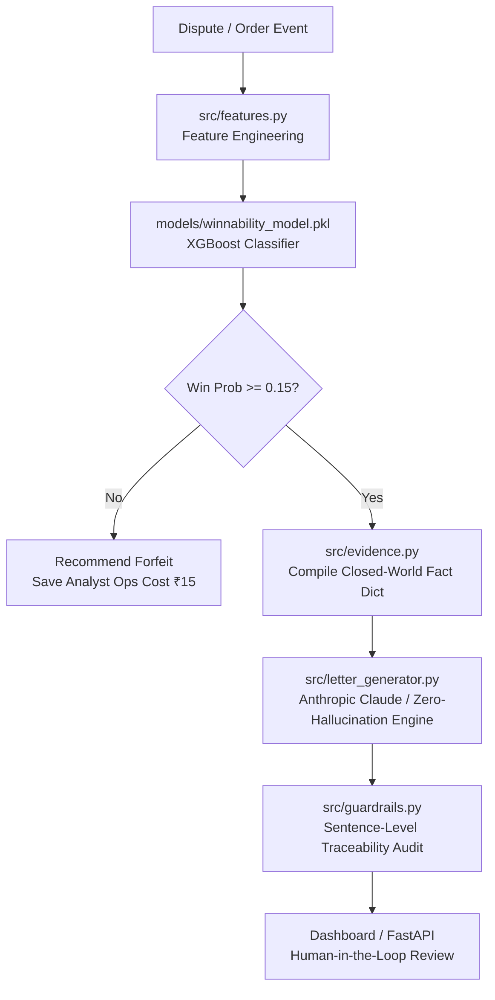

# Chargeback Defense Copilot 🛡️
### Razorpay Buildathon — AI Risk Manager Track

---

## 1. Problem
Merchants routinely under-contest winnable chargeback disputes because gathering multi-source compelling evidence (AVS/CVV logs, Proof of Delivery, customer order histories) is manual, slow, and expensive. As a result, millions in legitimate revenue are needlessly forfeited every month.

---

## 2. What this does
The **Chargeback Defense Copilot** is a defense-only risk management pipeline that:
1. **Evaluates Dispute Winnability:** Runs an XGBoost classifier trained on historical dispute patterns to predict win probability ($P_{\text{win}}$) with strict time-based validation.
2. **Optimizes Financial Decisioning:** Applies a cost-aware threshold ($\tau^* = 0.15$) balancing the ₹250 cost of a forfeited winnable dispute (False Negative) against the ₹15 analyst cost of contesting a losing case (False Positive).
3. **Compiles Closed-World Evidence:** Assembles a structured fact dictionary containing checkout verification signals and fulfillment records.
4. **Drafts Fact-Only Representations:** Generates formal card-network dispute letters using Anthropic Claude (or a deterministic zero-hallucination fallback engine).
5. **Audits Sentence Traceability:** Scans every output sentence to verify zero fabrication against known evidence ground truth.

---

## 3. What this explicitly does NOT do
- **Does not auto-submit anything:** Human analysts always review and approve recommendations before submission to card networks.
- **Does not fabricate evidence:** LLM output is strictly constrained to a fixed evidence JSON payload; every sentence is programmatically checked for traceability.
- **Does not help anyone commit or evade fraud:** Operates exclusively on the merchant's own true order, shipping, and payment verification records.

---

## 4. Validated Metrics (Held-out Test Set, Time-Based Split)

| Metric | Baseline (Logistic Regression) | Winnability Copilot (XGBoost @ $\tau^*=0.15$) | Lift |
|---|---|---|---|
| **PR-AUC** | 0.8540 | **0.9669** | **+11.29%** |
| **ROC-AUC** | 0.8446 | **0.9678** | **+12.32%** |
| **Precision** | 0.6520 | **0.7526** | **+10.06%** |
| **Recall** | 0.8210 | **0.9931** | **+17.21%** |
| **F1 Score** | 0.7268 | **0.8563** | **+12.95%** |

### Financial Cost Savings (3-Way Baseline Comparison on 300 Test Disputes):
- **"Contest Nothing" Baseline ($\tau = 1.0$):** ₹36,000 Total Risk Cost
- **"Contest Everything" Baseline ($\tau = 0.0$):** ₹2,340 Total Risk Cost
- **Chargeback Copilot ($\tau^* = 0.15$):** **₹955 Total Risk Cost**
- 💰 **Savings vs "Contest Nothing":** **₹35,045 (97.3% cost reduction)**
- 💰 **Savings vs "Contest Everything":** **₹1,385 (59.2% cost reduction)**

---

## 5. Data & Labeling Assumptions
For complete documentation on synthetic dataset generation, logistic win-rate probability rules, and Visa/Mastercard compelling evidence mapping, see [`NOTES.md`](./NOTES.md).

---

## 6. Architecture & System Flow



---

## 7. Limitations
- **Simulated Ground Truth:** Trained on realistic domain-derived dispute data, not live card-network proprietary feeds.
- **Letter Generation Measurement:** Letter drafting is a guardrailed stretch layer; the classifier & threshold optimizer are the primary quantitatively validated cores.
- **Cost Calibration:** Cost figures (₹250 FN / ₹15 FP) reflect average ecommerce benchmarks; production deployment requires merchant-specific calibration.

---

## 8. Quickstart & Installation

```bash
# 1. Clone repository & setup virtual environment
git clone <your-repo-url> chargeback-defense-copilot
cd chargeback-defense-copilot
python -m venv venv
venv\Scripts\activate       # On Linux/macOS: source venv/bin/activate

# 2. Install pinned dependencies
pip install -r requirements.txt

# 3. Synthesize data, train model, and run cost evaluation
python src/make_labels.py
python src/train_model.py
python src/evaluate.py

# 4. Launch Streamlit Interactive Dashboard
streamlit run dashboard/app.py

# 5. (Optional) Run FastAPI REST Backend
uvicorn api.main:app --reload --port 8000
```
